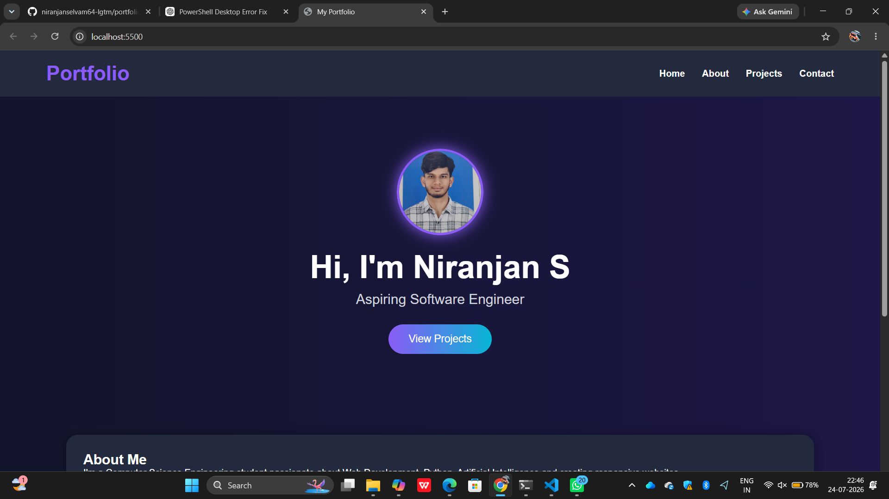
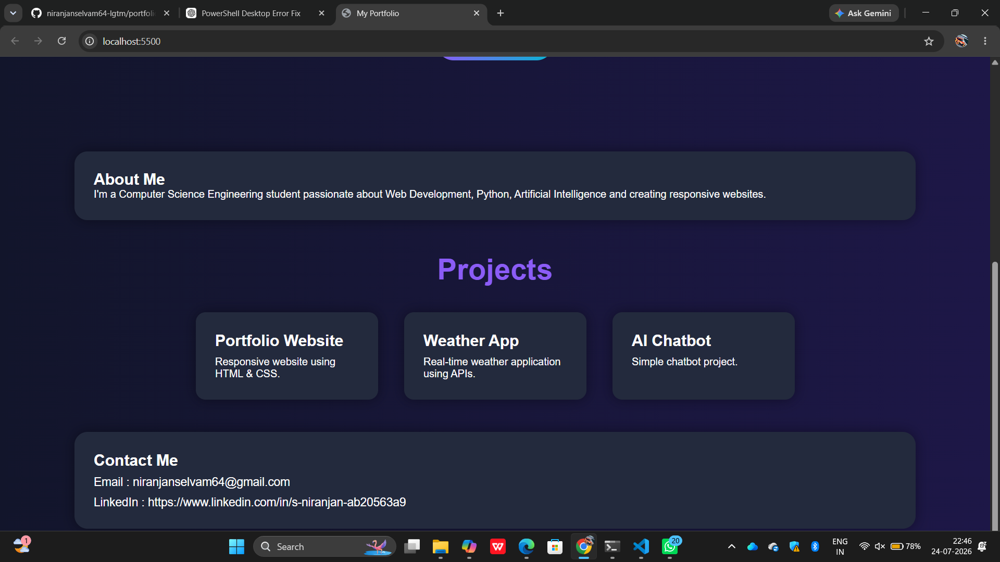

# Ex01 Portfolio
## Date: 24/07/2026

## AIM
To create a Portfolio using HTML and CSS.

## ALGORITHM
### STEP 1
Create an HTML file (index.html)

### STEP 2
Create a CSS file (style.css)

### STEP 3
Include a navigation bar with links to different sections.

### STEP 4
Add structured sections for introduction, about, projects, and contact details.

### STEP 5
Define global styles for fonts, colors, and layout.

### STEP 6
Style the header, navigation bar, and sections.

### STEP 7
Use Flexbox or CSS Grid for layout design.

### STEP 8
Add hover effects and transitions for interactivity.

### STEP 9
Add Images and Media.

### STEP 10
Use optimized images for a professional look.

### STEP 11
Open the HTML file in a browser to check layout and functionality.

### STEP 12
Fix styling issues and refine content placement.

### STEP 13
Deploy the Portfolio.

### STEP 14
Upload to GitHub Pages for free hosting.

## PROGRAM
```
<!DOCTYPE html>
<html lang="en">
<head>
    <meta charset="UTF-8">
    <meta name="viewport" content="width=device-width, initial-scale=1.0">
    <title>My Portfolio</title>

<style>
    *{
    margin:0;
    padding:0;
    box-sizing:border-box;
    font-family:Arial, Helvetica, sans-serif;
}

body{

background:linear-gradient(to right,#12152b,#1d1747);

color:white;

}

/* Header */

header{

display:flex;

justify-content:space-between;

align-items:center;

padding:20px 80px;

background:#232a3d;

}

.logo{

color:#8b5cf6;

font-size:35px;

}

nav a{

text-decoration:none;

color:white;

margin-left:25px;

font-weight:bold;

}

nav a:hover{

color:#8b5cf6;

}

/* Home */

.home{

text-align:center;

padding:90px;

}

.profile{

width:150px;

height:150px;

border-radius:60%;

border:4px solid #8b5cf6;

box-shadow:0 0 25px #8b5cf6;

margin-bottom:20px;

object-fit:cover;

}

.home h1{

font-size:55px;

margin-bottom:10px;

}

.home p{

font-size:24px;

color:#d1d5db;

margin-bottom:30px;

}

button{

padding:15px 35px;

border:none;

border-radius:30px;

background:linear-gradient(to right,#8b5cf6,#06b6d4);

color:white;

font-size:18px;

cursor:pointer;

}

button:hover{

transform:scale(1.05);

}

/* About */

.box{

width:85%;

margin:50px auto;

padding:30px;

background:#232a3d;

border-radius:20px;

box-shadow:0 0 20px rgba(0,0,0,.4);

}

.title{

text-align:center;

margin:40px;

color:#8b5cf6;

font-size:45px;

}

/* Projects */

.project-container{

display:flex;

justify-content:center;

gap:40px;

flex-wrap:wrap;

margin-bottom:50px;

}

.card{

background:#232a3d;

width:280px;

padding:30px;

border-radius:15px;

box-shadow:0 0 20px rgba(0,0,0,.4);

transition:.3s;

}

.card:hover{

transform:translateY(-10px);

}

.card h2{

margin-bottom:10px;

}

/* Contact */

#contact p{

margin-top:10px;

font-size:18px;

}
</style>
</head>
<body>

<!-- Navigation -->

<header>
    <h2 class="logo">Portfolio</h2>

    <nav>
        <a href="#">Home</a>
        <a href="#about">About</a>
        <a href="#projects">Projects</a>
        <a href="#contact">Contact</a>
    </nav>
</header>

<!-- Home -->

<section class="home">

    

    <h1>Hi, I'm Niranjan S</h1>

    <p>Aspiring Software Engineer</p>

    <button>View Projects</button>

</section>

<!-- About -->

<section id="about" class="box">

<h2>About Me</h2>

<p>
I'm a Computer Science Engineering student passionate about Web Development,
Python, Artificial Intelligence and creating responsive websites.
</p>

</section>

<!-- Projects -->

<section id="projects">

<h1 class="title">Projects</h1>

<div class="project-container">

<div class="card">
<h2>Portfolio Website</h2>
<p>Responsive website using HTML & CSS.</p>
</div>

<div class="card">
<h2>Weather App</h2>
<p>Real-time weather application using APIs.</p>
</div>

<div class="card">
<h2>AI Chatbot</h2>
<p>Simple chatbot project.</p>
</div>

</div>

</section>

<!-- Contact -->

<section id="contact" class="box">

<h2>Contact Me</h2>

<p>Email : niranjanselvam64@gmail.com</p>

<p>LinkedIn :
https://www.linkedin.com/in/s-niranjan-ab20563a9
</p>

</section>

</body>
</html>
```

## OUTPUT



## RESULT
The program for creating Portfolio using HTML and CSS is executed successfully.